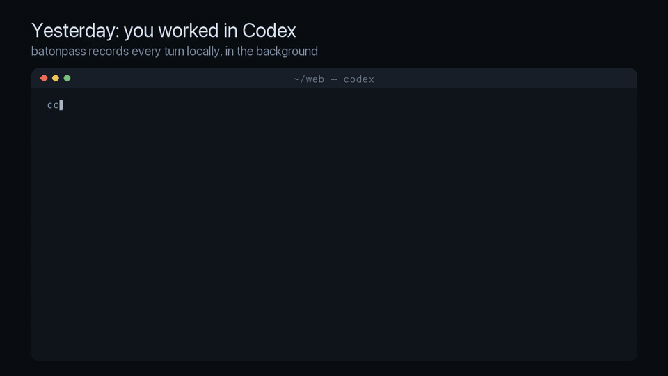

# batonpass

Automatic, local, verbatim session handoff between Codex and Claude Code.

Finish a turn in Codex, open Claude Code in the same repository, and it already knows what Codex just did: the last exchanges word for word, the goal, the pull requests and the state of the branch. The same works from Claude Code to Codex. No command to remember, no hosted service, no model-written summary.



## How it works

- **`Stop` hook** (both tools, runs in the background): reads the new lines of the session transcript, removes secrets, stores the dialogue in a local SQLite ledger (`~/.baton/baton.db`) and renders a numbered snapshot of the project.
- **`SessionStart` hook** (both tools): injects the latest brief, about 2,000 tokens, as context. No network call, no model call.
- **`PreCompact` hook**: stores everything before the tool compacts its own context.
- Sessions are grouped by git remote, so clones and worktrees of one repository share one history.

The brief is framed as prior context, not instructions, and always tells the new session how to look further back: `baton search "<words>"`, `baton show --full`, or the original session (`codex resume <id>`, `claude --resume <id>`).

## Install

Requires Node.js 24 or later.

```bash
npm install -g @batonpass/cli
baton install --dry-run
baton install
```

`baton install` merges three hooks into `~/.claude/settings.json` and `~/.codex/hooks.json`, installs the `baton-resume` skill for both tools, keeps a backup of every file it changes, and records what it added so `baton uninstall` removes exactly that. Codex asks you to review and trust new hooks once: run `/hooks` in Codex.

Existing history is read on the first `baton ingest` (the last 30 days, at most 64 MiB per transcript).

## Commands

| Command | What it does |
| --- | --- |
| `baton status` | Projects, sessions per tool, snapshot age, Jev spend today |
| `baton show [--full] [--project id] [--json]` | Print the latest snapshot for this repository |
| `baton ingest [--all] [--project id]` | Read new transcript lines now and refresh snapshots |
| `baton search <words…>` | Full-text search over this project's redacted history |
| `baton note <text…>` | Pin a note into every future snapshot of this project |
| `baton resume codex` / `baton resume claude` | Start the other tool here with the brief as its first prompt |
| `baton doctor [--jev]` | Check Node, hooks, transcripts, ledger health and redaction counts |
| `baton eval` | Run the recall evaluation and write a scorecard |
| `baton install` / `baton uninstall` | Add or remove the hooks and the skill |

## Privacy

- Transcripts never leave your machine. The ledger lives in `~/.baton` (directory `0700`, database `0600`).
- Tool outputs are never stored (Claude Code's compaction summaries are, and the model writes those from the whole context). Everything stored passes a secret redactor first.
- The default strategy makes no network call. The only optional network use is Jev (below) and read-only `gh` for open pull requests.

Details: [docs/privacy.md](docs/privacy.md).

## Selection

The brief keeps the most recent dialogue turns verbatim until its budget is spent (`recent-dialogue`, the default). With a TypeSafe key you can opt in to `jev-select`: when the dialogue does not fit, TypeSafe's Jev model marks exchanges that are safe to cut, and only confident answers are acted on. `jev.rules` (experimental) extracts standing instructions into their own section.

```toml
# ~/.baton/config.toml
[select]
strategy = "jev-select"        # default "recent-dialogue"

[jev]
maxInputTokensPerDay = 2000000 # about $0.08 a day at the published price
rules = false

[aliases]
"~/old/checkout/of/web" = "github.com/acme/web"
```

## Evaluation

`baton eval` rebuilds 8 synthetic multi-session histories (Codex and Claude Code mixed), renders the brief with each strategy, and asks a fresh `claude -p` session 64 questions about decisions, constraints, identifiers, verified results and open items: once from the brief alone, once with one `baton search`. Latest scorecard ([evals/results](evals/results/SCORECARD-2026-09-26.md), answered by Claude Haiku through `claude -p`):

| Strategy | Recall, brief only | Recall, brief + one search | Brief tokens (avg) |
| --- | --- | --- | --- |
| no context | 0.0% (0/64) | 70.3% (45/64) | 0 |
| `recent-dialogue` (default) | 71.9% (46/64) | 95.3% (61/64) | 1,497 |
| `jev-select` | not yet measured (needs a TypeSafe key) | | |

A release ships only when the default strategy is at least as good as `recent-dialogue` on both measures, beats having no context, and the run had no failed answers.

## Supported transcripts

Codex rollouts (`~/.codex/sessions`, CLI 0.155 format) and Claude Code sessions (`~/.claude/projects`, 2.1.x). Readers ignore unknown line types; `baton doctor` reports malformed lines. Adding another agent means adding one reader: see [docs/writing-a-reader.md](docs/writing-a-reader.md).

## License

MIT. Contributions welcome: see [CONTRIBUTING.md](CONTRIBUTING.md).
